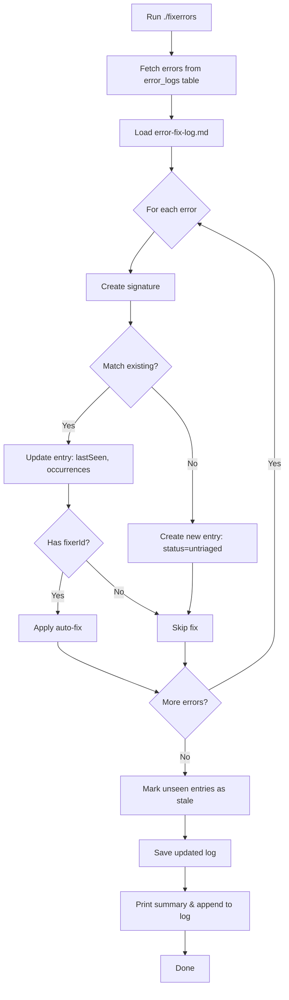

# Fixerrors Command - Implementation Summary

**Date:** 2026-01-22  
**Status:** ✅ COMPLETED  
**PRD Reference:** Internal Debug Tooling

## What Was Built

A complete automated error analysis and fixing workflow accessible via the `./fixerrors` command at repo root.

## Files Created

1. **`./fixerrors`** - Executable bash wrapper
2. **`scripts/fixerrors.ts`** - Main TypeScript implementation (287 lines)
3. **`docs_private/error-fix-log.md`** - Structured error tracking log
4. **`docs_private/fixerrors-workflow.md`** - Complete documentation

## How It Works



## Key Features

✅ **Automatic Error Detection**
- Fetches up to 100 recent errors from `error_logs` table
- Creates normalized signatures for pattern matching
- Tracks first/last seen timestamps and occurrence counts

✅ **Pattern Matching & Tracking**
- Matches errors against known signatures in error-fix-log.md
- Updates existing entries or creates new ones
- Auto-marks stale entries (not seen in current run)

✅ **Auto-Fix Framework**
- Extensible fixer registry for adding auto-fix functions
- Applies fixes when `fixerId` is set and status allows
- Tracks fix results in entry notes

✅ **Comprehensive Reporting**
- Terminal summary with stats breakdown
- Run history appended to log file
- Actionable items highlighted

✅ **Status Lifecycle Management**
- `untriaged` → `investigating` → `fix_applied` → `resolved`
- `wontfix` for acceptable issues
- `stale` for inactive issues

## Usage Example

```bash
# Start dev server in one terminal
npm run dev

# Run fixerrors in another terminal
./fixerrors
```

**Sample Output:**
```
🔧 FIXERRORS - Automated Error Analysis & Fixing
================================================

📥 Fetching recent errors from error_logs...
Found 6 error(s)

💾 Saving updated error fix log...

═══════════════════════════════════════════════════════════
SUMMARY
═══════════════════════════════════════════════════════════
Total Errors Analyzed:    6
Matched to Known Issues:  6
New Issues Detected:      0
Fixes Applied:            0
Fixes Failed:             0

Total Tracked Issues:     1

Issue Status Breakdown:
  untriaged       1

═══════════════════════════════════════════════════════════

⚠️  ACTIONABLE ITEMS:
   - 1 untriaged issue(s) need investigation
   - Review docs_private/error-fix-log.md for details

✅ Fixerrors complete.
```

## Error Fix Log Format

### Machine-Readable JSON Block

```json
{
  "version": "1.0.0",
  "entries": [
    {
      "signature": "ReferenceError::Global Error Handler::/debug::timesheets is not defined",
      "firstSeen": "2026-01-22T19:22:24.869+00:00",
      "lastSeen": "2026-01-22T19:45:32.471+00:00",
      "occurrences": 12,
      "status": "untriaged",
      "plan": "Manual investigation needed",
      "notes": "Error Type: ReferenceError\nComponent: Global Error Handler\nPage: http://localhost:3001/debug"
    }
  ]
}
```

### Human-Readable Sections

- Field definitions and status lifecycle
- Usage instructions
- Run history (auto-appended)

## Adding Auto-Fixers

Extend the `fixers` object in `scripts/fixerrors.ts`:

```typescript
const fixers: Record<string, (error: ErrorLogEntry) => Promise<string>> = {
  fix_your_error: async (error: ErrorLogEntry) => {
    // Analyze error
    // Apply fix (update files, run scripts, etc.)
    // Return success message
    return 'Fix applied successfully';
  },
};
```

Then update the entry in `error-fix-log.md` to reference the fixer:

```json
{
  "signature": "...",
  "fixerId": "fix_your_error",
  "status": "investigating"
}
```

## Integration Points

- **Data Source:** `error_logs` table (same as `/debug` page)
- **Authentication:** Supabase service role key from `.env.local`
- **Storage:** `docs_private/error-fix-log.md` (gitignored)
- **Execution:** Bash + TypeScript via `npx tsx`

## Benefits

1. **Proactive Error Management** - Catch and track errors early
2. **Pattern Recognition** - Identify recurring issues automatically
3. **Automated Fixes** - Reduce manual debugging time
4. **Historical Tracking** - Maintain knowledge base of known issues
5. **Team Communication** - Shared error log for collaboration

## Testing Performed

✅ Initial run with empty log - creates first entry  
✅ Subsequent run - matches existing entries, updates counts  
✅ JSON block parsing and saving - handles different line endings  
✅ Run history appending - preserves existing content  
✅ Summary output - clear and actionable  
✅ No linter errors in TypeScript code  

## Next Steps for Users

1. **Run after starting dev server** - `./fixerrors`
2. **Review untriaged issues** - Check `docs_private/error-fix-log.md`
3. **Add fixers as patterns emerge** - Extend the fixers registry
4. **Update PRD references** - Add notes field to link issues to PRDs
5. **Integrate into workflow** - Run periodically during development

## Related Documentation

- **Full Documentation:** `docs_private/fixerrors-workflow.md`
- **Error Fix Log:** `docs_private/error-fix-log.md`
- **Debug Page:** `docs/debug-page-styling-fixes.md`

## Security & Privacy

- ✅ Service role key never printed or logged
- ✅ `docs_private/` folder is gitignored
- ✅ Error summaries sanitized for display
- ✅ Fix functions should validate before making changes
