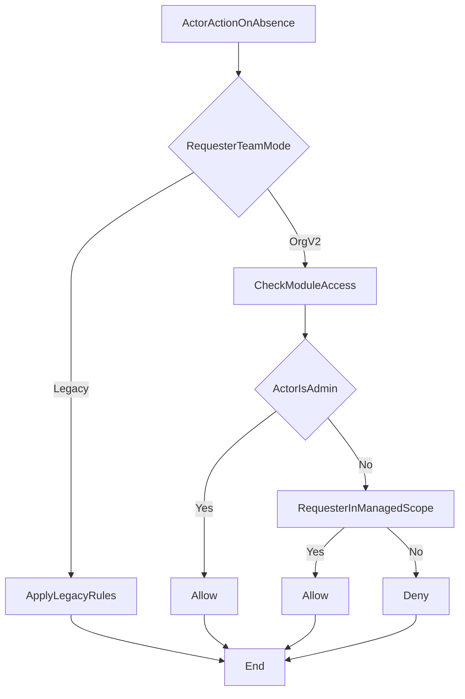

# Absence and Leave Workflow Spec v2

## Document Control
- Owner: Product Owner
- Contributors: Engineering Lead, Operations Lead
- Status: Draft for review
- Risk level: High
- Implementation window: BusinessHours
- Primary dependencies: `Org-Hierarchy-v2-Architecture.md`, `RLS-and-Authorization-Spec.md`

## Objective
Define workflow-specific authorization and visibility behavior for absence and leave approvals under the new hierarchy model, while preserving legacy behavior for non-migrated teams.

## Scope
- In scope:
  - Absence and leave request creation, review, approval, rejection.
  - Visibility filtering for pending queues and detail views.
  - Team-by-team dual-mode behavior.
- Out of scope:
  - Timesheets/workshop/report approvals (future phase).

## Definitions
- Requester: user who owns the absence request.
- Actor: user performing an action (view, approve, reject).
- Team mode:
  - `legacy`: current behavior.
  - `org_v2`: hierarchy-scoped behavior.

## Authorization Matrix (Phase 1)

| Actor | Team mode = legacy | Team mode = org_v2 |
|---|---|---|
| Employee | Own requests only | Own requests only |
| Manager (non-admin) | Existing legacy visibility | Requests for managed scope only |
| Admin | Global visibility and actions | Global visibility and actions |

## Action Rules
- Create request:
  - Employee can create own absence/leave requests.
  - Manager/admin create-for-user remains unchanged in Phase 1 where already supported.
- Approve/reject request:
  - Admin can approve/reject across teams.
  - Non-admin manager can approve/reject only if requester is in managed scope and team mode is `org_v2`.
  - Legacy team behavior remains unchanged until that team is migrated.

## Visibility Rules
- Pending approvals list:
  - Must be filtered by effective scope, not only by request status.
- Request detail:
  - Access denied if actor is outside effective scope.
- Historical approvals:
  - Preserve existing records and approver identities.

## Managed Scope Definition (Phase 1)
- Primary rule: direct line manager relationship.
- If requester has no valid manager mapping:
  - Team cannot be switched to `org_v2` until corrected.
- Cross-team exception:
  - Admin only.

## Team Toggle Behavior
- Toggle granularity: team + workflow (`absence_leave`).
- Default for all teams: `legacy`.
- On switching to `org_v2`:
  - Visibility and action checks must switch immediately for that team.
  - No deployment required for mode changes.

## Decision Flow

## UI and API Expectations
- UI must never assume visibility; it must reflect server-filtered data.
- API must return authorization-safe datasets.
- Action endpoints must recheck scope even if UI already gated buttons.

## Audit Requirements
- Approval and rejection must record actor and timestamp.
- Denied action attempts should be logged for operational diagnostics.
- Team mode changes should be auditable with actor and time.

## Go / No-Go Criteria
- Go when:
  - Matrix behavior is approved by business stakeholders.
  - Pilot team manager mappings are valid.
  - API + UI contracts are updated to consume scoped results.
- No-Go when:
  - Any unresolved exception path permits non-admin cross-team approval.
  - Pending queue filtering does not align with enforced server scope.
