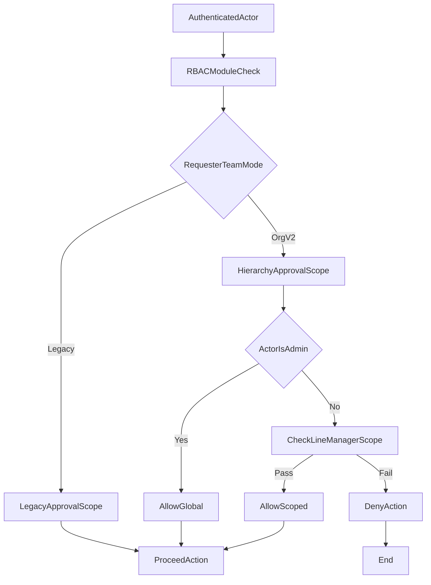

# Org Hierarchy v2 Architecture

## Document Control
- Owner: Engineering Lead
- Contributors: Product Owner, Technical Architect, Operations Lead
- Status: Draft for review
- Risk level: High
- Implementation window: BusinessHours
- Primary dependencies: `Absence-Leave-Workflow-Spec-v2.md`, `Data-Model-and-Migration-Spec.md`, `RLS-and-Authorization-Spec.md`

## Objective
Define a coexistence architecture where current RBAC remains in place while a new org hierarchy layer controls workflow-scoped approval visibility and actions.

## Scope
- In scope:
  - Phase 1 workflow: absence and leave approvals.
  - Coexistence of legacy RBAC and hierarchy v2.
  - Team-by-team migration toggle model.
  - Admin-only cross-team exception.
- Out of scope:
  - Direct implementation changes.
  - Timesheets/workshop/report enforcement rollout (covered as later expansion).

## Current Architecture Summary
- Module access is role-permission based (RBAC).
- Manager-level approval visibility is currently broad/global in key workflows.
- No first-class line manager reporting chain exists in the app model.
- Authorization behavior is split across UI checks, service utilities, and RLS.

## Target Coexistence Model
- Keep RBAC for module and navigation access.
- Add hierarchy authorization as a second layer for workflow scope.
- Resolve permissions with this order:
  1. Authenticate actor.
  2. Check module access (RBAC).
  3. Determine team migration mode.
  4. Apply legacy scope or hierarchy scope based on team mode.
  5. Apply admin global override where allowed.

## Authorization Principles
- Principle 1: Least privilege by default for managers.
- Principle 2: Workflow-scoped rules, not one global rule for all approvals.
- Principle 3: Server and database must both enforce the same result.
- Principle 4: Team toggles must be reversible without deployment.
- Principle 5: Admin cross-team visibility remains available during migration.

## Phase 1 Actor Model
- Employee:
  - Create own absence requests.
  - View own requests and outcomes.
- Manager (non-admin):
  - Approve/reject only within managed scope for migrated teams.
  - Legacy behavior remains only for non-migrated teams until switched.
- Admin:
  - Full cross-team visibility and approval authority.
  - Can manage migration toggles and exception governance.

## Coexistence Decision Flow

## Non-Functional Requirements
- No service interruption during business-hours feature development.
- Zero-downtime cutover approach for production data and policies.
- Auditability for every approval decision path.
- Fast rollback path by team toggle.

## Open Risks
- Drift between UI logic and DB policy logic.
- Incorrect manager mappings causing hidden approvals.
- Partial migration states across teams.
- Historical records visibility mismatch during transition.

## Mitigations
- Single policy definitions in specs before implementation.
- Staged rollout with pilot team and explicit rollback checklist.
- Pre-cutover validation on manager-team mappings.
- Post-cutover smoke checks tied to go/no-go gates.

## Go / No-Go Criteria (For Implementation Kickoff)
- Go when:
  - Architecture, data, RLS, and runbook docs are approved.
  - Team migration order and owner matrix are finalized.
  - Business-hours and out-of-hours step boundaries are agreed.
- No-Go when:
  - Any scope conflict remains between RBAC and hierarchy rules.
  - Rollback path is undefined for any migration wave.
