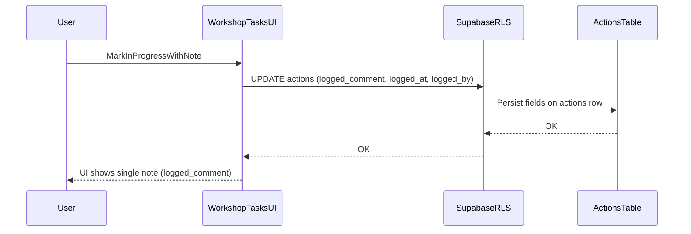

## Feature 1: Workshop Task comments timeline

### PRD linkage

- **Base module PRD**: [docs/PRD_WORKSHOP_TASKS.md](docs/PRD_WORKSHOP_TASKS.md) (extends the “Workshop Tasks” vehicle task workflow)
- **Relevant existing requirement area**: “Status Workflow” + “Workshop comments / logged_comment / actioned_comment”
- **This feature**: add a **multi-note timeline** so workshop staff can add notes over time **without changing status**

---

### Context (problem + goal)

- **Current**: Workshop Tasks have statuses (Pending, In Progress, Completed, etc). When status changes, a **single note** is stored in the `actions` row.
- **Need**: Allow **multiple notes over time** (comments) even when status does not change.
- **Decision (confirmed)**:
  - **Timeline includes status-change notes as timeline events** (unified timeline)
  - **No comment visibility rules in v1** (all workshop-tasks permitted users can see all comments)

---

### Current-state audit (where the single comment is stored)

#### Database storage

- **Workshop Tasks are stored as rows in `actions`**
  - Migration that introduced workshop task support: [supabase/migrations/20260106_workshop_tasks.sql](supabase/migrations/20260106_workshop_tasks.sql)
  - Completion note column migration: [supabase/migrations/20260109_add_actioned_comment_to_actions.sql](supabase/migrations/20260109_add_actioned_comment_to_actions.sql)
- **Single status-change notes**
  - **In Progress note**: `actions.logged_comment` (+ `logged_at`, `logged_by`)
  - **Completed note**: `actions.actioned_comment` (+ `actioned_at`, `actioned_by`)
- **Existing “task description / detail”**
  - `actions.workshop_comments` (initial detail for manual workshop tasks; displayed as “Notes:” today)

#### API layer

- **No dedicated Workshop Tasks API routes today** for task updates/comments.
- The Workshop Tasks UI currently writes directly to Supabase from the browser (client-side queries).
- Established server-route patterns (for reference when adding comment endpoints):
  - Uses `createClient()` from [lib/supabase/server.ts](lib/supabase/server.ts)
  - Auth via `supabase.auth.getUser()`
  - Role checks via helpers in [lib/utils/permissions.ts](lib/utils/permissions.ts)
  - Validation patterns live in [lib/validation/schemas.ts](lib/validation/schemas.ts)

#### UI layer (where notes show today)

- Workshop Tasks page: [app/(dashboard)/workshop-tasks/page.tsx](app/(dashboard)/workshop-tasks/page.tsx)
  - **Pending cards** show `actions.workshop_comments` as “Notes: …”
  - **In Progress cards** show `actions.logged_comment` as “Progress Note: …”
  - **Completed cards** currently do not show a timeline; completion is captured via `actions.actioned_comment` in the completion modal
- Legacy/manager Actions page (useful for cross-checking conventions): [app/(dashboard)/actions/page.tsx](app/(dashboard)/actions/page.tsx)

#### Types + tests

- DB types for `actions` live in: [types/database.ts](types/database.ts)
- Workshop Tasks RLS integration test: [tests/integration/workshop-tasks-rls.test.ts](tests/integration/workshop-tasks-rls.test.ts)

---

### Existing data flow (current)

#### Status-change note flow (single note)

- **UI**: `app/(dashboard)/workshop-tasks/page.tsx`
- **Client Supabase**: [lib/supabase/client.ts](lib/supabase/client.ts)
- **DB write**: updates the `actions` row fields:
  - Pending → In Progress: sets `status='logged'`, `logged_comment`, `logged_at`, `logged_by`
  - In Progress → Completed: sets `status='completed'`, `actioned_comment`, `actioned_at`, `actioned_by`
- **Read**: UI fetches `actions` rows and renders the single note fields directly on the task cards

#### Mermaid (high-level)

---

### Data model plan (task comments timeline)

#### Approach

- Keep `actions` as the “task” source of truth (consistent with the module).
- Add a new table for **freeform comments** (multiple per task).
- Render a **unified timeline** by merging:
  - **Derived status events** from existing `actions.*_comment` + `*_at` + `*_by`
  - **Freeform comments** from new table

#### New table: `workshop_task_comments` (v1)

- **Table**: `workshop_task_comments`
- **Purpose**: store multiple comments per workshop task (`actions` row)
- **Fields**
  - `id`: UUID, primary key
  - `task_id`: UUID, foreign key to `actions.id` (on delete cascade)
  - `author_id`: UUID, foreign key to `auth.users.id` (matches `profiles.id`)
  - `body`: text (comment content)
  - `created_at`: timestamptz (default now)
- **Deferred (not in v1)**
  - `visibility` (client chose no visibility in v1)
  - `pinned` (not requested in v1; can be added later without breaking changes)

#### Indexes + foreign keys

- **Foreign keys**
  - `task_id` → `actions.id` (cascade delete)
  - `author_id` → `auth.users.id`
- **Indexes**
  - Composite index on `(task_id, created_at DESC)` for timeline queries
  - Index on `author_id` for audits and author filtering (optional but useful)

#### RLS policies (v1)

- Enable RLS on `workshop_task_comments`.
- **Read**: allow users with `workshop-tasks` permission to read comments for tasks where `actions.action_type` is workshop-related.
- **Write**: allow users with `workshop-tasks` permission to insert comments if `author_id = auth.uid()` and the task is workshop-related.
- **Edit/Delete**:
  - Allow comment **author** to update/delete their own comment.
  - Allow **manager/admin** to update/delete any comment.
- Note: visibility is not implemented in v1, so no additional visibility clauses.

---

### Migration steps (no code; step-by-step tasks)

#### New migration files to add

- **SQL migration**: `supabase/migrations/YYYYMMDD_workshop_task_comments.sql`
  - Create `workshop_task_comments` table + constraints + indexes
  - Enable RLS + policies described above
- **Runner script**: `scripts/run-workshop-task-comments-migration.ts`
  - Must follow the `pg` connection pattern in [docs/guides/MIGRATIONS_GUIDE.md](docs/guides/MIGRATIONS_GUIDE.md)
  - Must be executed via `POSTGRES_URL_NON_POOLING` (see [docs/guides/HOW_TO_RUN_MIGRATIONS.md](docs/guides/HOW_TO_RUN_MIGRATIONS.md))

#### Backfill strategy (from existing single comment)

Goal: ensure existing “single comment” data appears in the new timeline without losing audit history.

- **Status-change notes**
  - No DB backfill required: `actions.logged_comment` and `actions.actioned_comment` remain in `actions`.
  - Timeline will render these as derived “status events”.
- **Initial task detail**
  - One-time backfill: for tasks with `actions.workshop_comments` populated, insert a first comment row into `workshop_task_comments`:
    - `task_id = actions.id`
    - `author_id = actions.created_by`
    - `body = actions.workshop_comments`
    - `created_at = actions.created_at`
  - After rollout, UI should stop rendering `actions.workshop_comments` as a separate “Notes:” block and instead rely on the timeline.

#### Type updates

- Update [types/database.ts](types/database.ts) to include `workshop_task_comments` Row/Insert/Update definitions.

---

### API plan (endpoints, auth, validation, response shapes)

Even though Workshop Tasks currently writes directly to Supabase from the browser, comments are a good place to introduce API routes for:
- consistent validation and error handling
- a unified timeline response (comments + derived status events)
- cleaner future extension (visibility, pinned, attachments)

#### New routes to add (Next.js App Router)

- **List timeline items (comments + derived status events)**
  - `GET /api/workshop-tasks/tasks/:taskId/comments`
  - File: `app/api/workshop-tasks/tasks/[taskId]/comments/route.ts`
  - Query params:
    - `cursor` (optional): for pagination
    - `limit` (optional; default 20; max 100)
    - `order` (optional): `asc` (oldest→newest) or `desc` (newest→oldest); default `asc`
- **Create comment**
  - `POST /api/workshop-tasks/tasks/:taskId/comments`
  - Same file as above
- **Edit comment**
  - `PATCH /api/workshop-tasks/comments/:commentId`
  - File: `app/api/workshop-tasks/comments/[commentId]/route.ts`
- **Delete comment**
  - `DELETE /api/workshop-tasks/comments/:commentId`
  - Same file as above

#### Auth rules (who can add/edit/delete)

- **All endpoints** require a logged-in user via `supabase.auth.getUser()` using [lib/supabase/server.ts](lib/supabase/server.ts).
- **Module access**:
  - Reject with 403 unless the user has Workshop Tasks module permission.
  - Use [lib/utils/permissions.ts](lib/utils/permissions.ts) helper(s) for permission checks where possible (and still rely on DB RLS as the final guard).
- **Create**: any workshop-permitted user can comment.
- **Edit/Delete**:
  - Author can edit/delete their own comment.
  - Manager/admin can edit/delete any comment.

#### Validation rules

Add schemas to [lib/validation/schemas.ts](lib/validation/schemas.ts):

- **Create comment**
  - `taskId`: UUID
  - `body`: required, trimmed, min 1 char, max 1000 chars (proposed v1 max)
- **Edit comment**
  - `commentId`: UUID
  - `body`: required, trimmed, min 1 char, max 1000 chars
- **List comments**
  - `cursor`: optional opaque string (or timestamp/id tuple)
  - `limit`: integer 1–100
  - `order`: enum `asc|desc`

#### Response shapes (proposed)

- **List response**
  - `success: true`
  - `taskId`
  - `items`: array of timeline items ordered by requested direction
    - Each item includes:
      - `id` (string; for derived status events, use a stable synthetic id like `status:logged:<actions.id>`)
      - `type`: `comment` | `status_event`
      - `created_at`
      - `author`: `{ id, full_name }` (best-effort; for derived events use `logged_by`/`actioned_by`; for comments use `author_id`)
      - `body`
      - `meta` (optional): e.g., `{ status: "logged" }` or `{ status: "completed" }`
  - `nextCursor` (optional)
- **Create response**
  - `success: true`
  - `comment` (the inserted row)
- **Edit response**
  - `success: true`
  - `comment` (updated row)
- **Delete response**
  - `success: true`

Error response (consistent across endpoints):
- `error: string`
- appropriate HTTP status: 400/401/403/404/409/500

---

### UI plan (where comment entry lives, timeline display, states)

#### Placement (v1)

- Add a **“Comments”** action on each task card in:
  - [app/(dashboard)/workshop-tasks/page.tsx](app/(dashboard)/workshop-tasks/page.tsx)
- Clicking opens a **task detail surface**:
  - Preferred: a shadcn/ui `Sheet` (drawer) for fast workflow (mobile-friendly)
  - Alternative: a `Dialog` if drawer is not desired
- The detail view contains:
  - task summary (vehicle, category, status)
  - the unified **timeline**
  - a comment composer at the bottom (“Add note…”)

#### Timeline behavior

- **Ordering**: `asc` by default (oldest→newest) so it reads like a history; show newest at the bottom.
- **Paging**:
  - Fetch first page (most recent N) is easier for performance, but it reverses the “story”.
  - Proposed compromise: request `order=desc` from API, then reverse in UI for display, with “Load older” prepends.
- **Display rules**
  - Derived status events:
    - “Marked In Progress” + show `logged_comment` text
    - “Marked Complete” + show `actioned_comment` text
  - Backfilled initial detail comment shows as a normal comment at task creation time.

#### Empty, loading, error states

- **Empty**: show “No comments yet. Add the first note.” (status events may still appear depending on task history)
- **Loading**: skeleton list for timeline + disabled composer
- **Error**: inline callout + “Retry” button; toast on mutation failure

#### Refactor note (keep file maintainable)

`app/(dashboard)/workshop-tasks/page.tsx` is already large. To keep changes safe:
- Extract comment/timeline UI into `components/workshop-tasks/TaskCommentsDrawer.tsx` (or similar)
- Keep page file responsible for task list + opening/closing the drawer

---

### Tests plan

#### Integration tests (DB/RLS)

- Extend [tests/integration/workshop-tasks-rls.test.ts](tests/integration/workshop-tasks-rls.test.ts) or add:
  - `tests/integration/workshop-task-comments-rls.test.ts`
- Coverage:
  - Workshop-permitted user can insert a comment for a workshop task
  - Workshop-permitted user can read comments for workshop tasks
  - Non-permitted user cannot read/insert comments
  - Author can update/delete own comment; non-author cannot
  - Manager/admin can update/delete any comment

#### API route tests

- Add tests under `tests/integration/` to call the new endpoints with:
  - unauthorized session → 401
  - missing permission → 403
  - invalid UUID/body → 400
  - happy paths → 200/201 with expected response shapes

#### UI tests

- Add lightweight UI test in `tests/ui/`:
  - open comments drawer
  - see timeline render status events
  - create comment → appears in list

---

### Key edge cases

- **Task has no `workshop_comments`**: timeline still works; may show only status events or user-added comments.
- **Older tasks created before backfill**: initial detail may not be present; status events still render from `actions`.
- **Deleted/renamed users**: author name may be missing; fallback to “Unknown user”.
- **Concurrent commenting**: ensure list endpoint supports pagination and stable ordering.
- **Long comments**: enforce max length; preserve line breaks in UI.
- **Permissions changes mid-session**: API/RLS should be source of truth; UI should handle 403 gracefully.

---

### Acceptance checklist (user-visible)

- A workshop user can add multiple comments to a task without changing status.
- The task detail view shows a unified timeline with:
  - task creation detail (from `workshop_comments` backfill)
  - “Marked In Progress” event and its note
  - “Marked Complete” event and its note
  - all freeform comments
- Comments appear in correct order and “Load older” works.
- Users can edit/delete their own comments; managers/admins can moderate any comment.
- Users without workshop-tasks permission cannot access the comments API or view task comments.
- Empty, loading, and error states are clear and usable.

---

### Estimated risk

- **Medium**: adds a new RLS-protected table plus new API routes and a UI surface, but stays isolated to Workshop Tasks and does not change the core `actions` workflow.

---

### Rollout plan

- **Step 1**: Add migration + runner; deploy schema first.
- **Step 2**: Deploy API routes (read-only first is acceptable: list timeline).
- **Step 3**: Deploy UI drawer with timeline rendering (status events + backfilled initial detail).
- **Step 4**: Enable create/edit/delete comment mutations.
- **Step 5**: Monitor errors via existing server error logging and confirm no RLS regressions.

