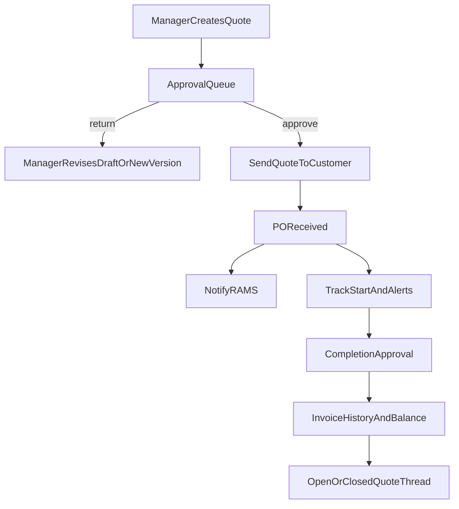

# Customers And Quotes Workflow Plan

## Current Baseline

The existing implementation already provides:

- Customer CRUD in `[app/(dashboard)/customers/page.tsx](app/(dashboard)`/customers/page.tsx), `[app/api/customers/route.ts](app/api/customers/route.ts)`, and `[app/api/customers/[id]/route.ts](app/api/customers/[id]/route.ts)`.
- Quote CRUD, status transitions, and PDF generation in `[app/(dashboard)/quotes/page.tsx](app/(dashboard)`/quotes/page.tsx), `[app/(dashboard)/quotes/components/QuoteFormDialog.tsx](app/(dashboard)`/quotes/components/QuoteFormDialog.tsx), `[app/(dashboard)/quotes/components/QuoteDetailsModal.tsx](app/(dashboard)`/quotes/components/QuoteDetailsModal.tsx), `[app/api/quotes/route.ts](app/api/quotes/route.ts)`, and `[app/api/quotes/[id]/route.ts](app/api/quotes/[id]/route.ts)`.
- Per-requester quote numbering via `[lib/utils/quote-number.ts](lib/utils/quote-number.ts)` and schema in `[supabase/migrations/20260309_customers_quotes_module.sql](supabase/migrations/20260309_customers_quotes_module.sql)`.
- Reusable email/notification patterns in `[lib/utils/email.ts](lib/utils/email.ts)`, `[app/api/messages/route.ts](app/api/messages/route.ts)`, and `[app/api/messages/notifications/route.ts](app/api/messages/notifications/route.ts)`.

## What The Client Is Asking For

Build a full workflow covering:

1. Manager quote creation with manager-specific numbering, attachments, manager email on the quote, and legal terms.
2. Internal approval queue where Charlotte’s function becomes a configurable approver role, with edit/return/approve actions and PO capture.
3. Automatic customer sending after approval, with CC recipients and standard email template.
4. Approved quotes tracking with PO and commercial visibility.
5. Automatic RAMS notification when PO is received.
6. Start date and reminder alerts.
7. Completion sign-off in full or part with comments.
8. Multi-invoice history and remaining balance tracking.
9. Quote revisions, extras, variations, future works, duplication, and better filtering.

## Recommended Design

### 1. Introduce A Configurable Workflow Model

Replace the current simple quote lifecycle with explicit commercial stages and role ownership.

Planned changes:

- Extend the quote status model beyond the current `draft -> pending_internal_approval -> sent -> won/lost -> ready_to_invoice -> invoiced` flow in `[app/(dashboard)/quotes/types.ts](app/(dashboard)`/quotes/types.ts).
- Add explicit workflow fields for:
  - requester/manager
  - approver role or assigned approver
  - approved/sent timestamps
  - PO received timestamp
  - job start date
  - completion status and comments
  - open/closed commercial state
- Keep approvers configurable rather than hard-coding Charlotte, while still supporting her as the default initial assignee.

### 2. Redesign Quote Numbering And Sign-Off Around Configurable Manager Series

The current sequence table only keys off free-text initials. That is too loose for the requested 5-digit manager ranges.

Planned changes:

- Add a manager-series configuration layer so each manager profile can own:
  - initials
  - quote number prefix/range start
  - sign-off defaults
  - manager email
- Update `[lib/utils/quote-number.ts](lib/utils/quote-number.ts)` so numbering is derived from the manager configuration instead of a manually editable initials text field.
- Replace the current free-text requester/sign-off behavior in `[app/(dashboard)/quotes/components/QuoteFormDialog.tsx](app/(dashboard)`/quotes/components/QuoteFormDialog.tsx) with a controlled selector/autofill pattern.

### 3. Add Quote Revisioning Under One Base Quote Number

You chose to keep one base quote number with version/variation history rather than separate standalone quote records.

Planned changes:

- Introduce a parent-child revision model under a single base quote reference.
- Treat the original quote, later revisions, and extras/variations/future works as versioned records tied to one commercial quote thread.
- Store revision metadata such as:
  - base quote id/reference
  - revision number or suffix
  - revision type (`revision`, `extra`, `variation`, `future_work`)
  - supersedes/superseded-by linkage
  - resend history
- Update quote UI so sent quotes remain editable by creating a new version instead of mutating the historical version in place.
- Add a duplicate action that seeds a new quote from an existing version.

### 4. Add Structured Commercial Tracking Tables

A single `po_number` field and single `invoice_number` field will not support the requested workflow.

Planned changes:

- Add quote attachment metadata table for supporting files and storage paths.
- Add PO/commercial fields to quotes or a dedicated quote commercial table for:
  - PO number
  - PO value
  - approved quote value
  - RAMS requested timestamp
- Add invoice history table with one row per invoice event:
  - invoice number
  - invoice date
  - amount invoiced
  - comments
  - optional line-level allocation or full-invoice flag
- Compute invoiced total and remaining balance per quote thread for list/detail views.
- Support leaving a job commercially open after partial invoicing/completion.

### 5. Expand The UI Around Role Queues And Operational Tracking

The current quote table/details modal are too narrow for the end-to-end workflow.

Planned changes:

- Add a configurable internal approval queue view for approvers.
- Enhance `[app/(dashboard)/quotes/components/QuotesTable.tsx](app/(dashboard)`/quotes/components/QuotesTable.tsx) with filters for:
  - approval status
  - PO received / missing
  - invoiced / not invoiced / partially invoiced
  - manager
  - customer
  - open / closed
  - start date windows
- Expand quote detail screens to support:
  - approval actions with return comments
  - PO entry
  - version history
  - attachments
  - start date and alerts
  - completion status/comments
  - invoice ledger
- Improve customer history in `[app/(dashboard)/customers/[id]/history/page.tsx](app/(dashboard)`/customers/[id]/history/page.tsx) so customers show richer quote thread status rather than only basic quote links.

### 6. Reuse Existing App Patterns For Email, Notifications, And Files

The repo already has workable building blocks for these concerns.

Planned changes:

- Reuse `[lib/utils/email.ts](lib/utils/email.ts)` for:
  - approval notifications
  - customer send email from `noreply@avsquires.co.uk`
  - RAMS trigger email to `conway@avsquires.co.uk`
  - start-date reminder alerts
- Reuse the `messages` / `message_recipients` pattern from `[app/api/messages/route.ts](app/api/messages/route.ts)` and `[app/api/messages/notifications/route.ts](app/api/messages/notifications/route.ts)` for in-app approval and workflow notifications.
- Reuse the Supabase Storage upload pattern already used elsewhere for quote attachments, rather than inventing a separate file mechanism.
- If delayed alerts are required server-side, add a scheduled route using the same protected cron approach already used elsewhere in the app.

## Implementation Phases

### Phase 1. Data Model And Workflow Foundation

- Create a migration extending quote schema for workflow ownership, approval, PO, start/completion, and revision metadata.
- Add new supporting tables for attachments and invoice history.
- Update generated/shared types in `[types/database.ts](types/database.ts)` and quote/customer UI types.

### Phase 2. API And Server Logic

- Refactor quote create/update APIs to support manager-based numbering, revisions, attachments, PO capture, completion, and invoice ledger operations.
- Add endpoints for quote version actions, attachment upload/delete, invoice add/update, and approval queue actions.
- Add server helpers for totals, remaining balance, revision resolution, and notification triggers.

### Phase 3. Frontend Workflow Screens

- Rework quote creation/edit UI.
- Add approver queue and approval actions.
- Add approved-quotes/commercial tracking views.
- Expand quote detail/history UX for revisions, invoices, start/completion, and attachments.
- Tighten customer-to-quote flow so customer context carries into new quotes.

### Phase 4. Notifications, Email, And Alerts

- Add standard outbound quote email flow after approval.
- Add RAMS trigger and start-date reminders.
- Add in-app notifications for approvers/managers.

### Phase 5. Verification And Rollout Safety

- Add unit/integration coverage for numbering, revisions, approval transitions, invoice balance calculations, and notification triggers.
- Validate migration impact and ensure historical quote records remain readable.

## Architecture Sketch

## Key Risks To Address In Build

- Preserving historical sent quotes while allowing new versions.
- Avoiding hard-coded user assumptions while still matching the client’s current named workflow.
- Keeping numbering atomic and stable across manager-specific ranges.
- Handling partial invoicing cleanly without breaking totals or status logic.
- Making approval/send notifications reliable without duplicating emails or reminders.

