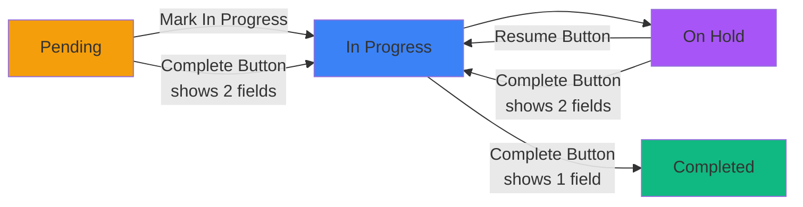

# Strict Workflow with Multi-Step Complete Modal

## Overview

Implement strict workflow enforcement (Pending → In Progress → Complete, On Hold → In Progress → Complete) while providing excellent UX by showing both required comment fields in a single "Mark Task Complete" modal. Backend performs two sequential database updates to maintain proper audit trail.

## Workflow Rules

### Enforced State Transitions



### Button Behavior:
- **Pending**: Can use "In Progress" or "Complete" buttons (Complete shows 2 fields)
- **In Progress**: Can use "On Hold" or "Complete" buttons (Complete shows 1 field)
- **On Hold**: Can use "Resume" or "Complete" buttons (Complete shows 2 fields)
- All Complete operations ensure task goes through In Progress status

## Implementation Plan

### 1. Add State for Multi-Step Detection

**File**: `app/(dashboard)/workshop-tasks/page.tsx` (~line 98)

Add new state variables after existing modal states:

```typescript
// Multi-step completion state
const [requiresIntermediateStep, setRequiresIntermediateStep] = useState(false);
const [intermediateComment, setIntermediateComment] = useState('');
```

### 2. Update handleMarkComplete Function

**File**: `app/(dashboard)/workshop-tasks/page.tsx` (~line 445)

Modify to detect if intermediate step is needed:

```typescript
const handleMarkComplete = (task: Action) => {
  setCompletingTask(task);
  setCompletedComment('');
  
  // Check if task needs intermediate step (pending or on_hold)
  if (task.status === 'pending' || task.status === 'on_hold') {
    setRequiresIntermediateStep(true);
    setIntermediateComment('');
  } else {
    setRequiresIntermediateStep(false);
    setIntermediateComment('');
  }
  
  setShowCompleteModal(true);
};
```

### 3. Update Complete Modal UI

**File**: `app/(dashboard)/workshop-tasks/page.tsx` (~line 2224)

**Add conditional sections**:

1. **Info banner** (when `requiresIntermediateStep`):
   - Blue banner explaining two-step process
   - Text: "This task will be moved to In Progress and then marked as Complete. Please provide notes for both steps."

2. **First comment field** (when `requiresIntermediateStep`):
   - Label: "Step 1: In Progress Note" (from Pending) or "Step 1: Resume Note" (from On Hold)
   - Placeholder contextual to status
   - Max 300 chars, required
   - Character counter

3. **Second comment field** (always shown):
   - Label: "Step 2: Completion Note" (when multi-step) or "Completion Note" (single step)
   - Existing field, max 500 chars, required
   - Character counter

### 4. Update confirmMarkComplete Function

**File**: `app/(dashboard)/workshop-tasks/page.tsx` (~line 489)

**Implement two-step database update**:

```typescript
const confirmMarkComplete = async () => {
  if (!completingTask) return;

  // Validate intermediate comment if required
  if (requiresIntermediateStep) {
    if (!intermediateComment.trim()) {
      toast.error('In Progress/Resume note is required');
      return;
    }
    if (intermediateComment.length > 300) {
      toast.error('In Progress/Resume note must be 300 characters or less');
      return;
    }
  }

  // Validate completion comment (always required)
  if (!completedComment.trim()) {
    toast.error('Completion note is required');
    return;
  }
  if (completedComment.length > 500) {
    toast.error('Completion note must be 500 characters or less');
    return;
  }

  try {
    setUpdatingStatus(prev => new Set(prev).add(completingTask.id));

    // Step 1: If needed, move to In Progress first
    if (requiresIntermediateStep) {
      const { error: intermediateError } = await supabase
        .from('actions')
        .update({
          status: 'logged',
          logged_at: new Date().toISOString(),
          logged_by: user?.id,
          logged_comment: intermediateComment.trim(),
        })
        .eq('id', completingTask.id);

      if (intermediateError) {
        console.error('Error in intermediate step:', intermediateError);
        throw intermediateError;
      }
    }

    // Step 2: Mark as complete
    const { error } = await supabase
      .from('actions')
      .update({
        status: 'completed',
        actioned: true,
        actioned_at: new Date().toISOString(),
        actioned_by: user?.id,
        actioned_comment: completedComment.trim(),
      })
      .eq('id', completingTask.id);

    if (error) {
      console.error('Error completing task:', error);
      throw error;
    }

    toast.success('Task completed successfully');
    setShowCompleteModal(false);
    setCompletingTask(null);
    setCompletedComment('');
    setIntermediateComment('');
    setRequiresIntermediateStep(false);
    await fetchTasks();
  } catch (error: any) {
    console.error('Error completing task:', error);
    toast.error(error?.message || 'Failed to complete task');
  } finally {
    setUpdatingStatus(prev => {
      const next = new Set(prev);
      next.delete(completingTask.id);
      return next;
    });
  }
};
```

### 5. Update Submit Button Validation

**File**: `app/(dashboard)/workshop-tasks/page.tsx` (Complete Modal, ~line 2276)

Update the disabled prop on submit button to check both fields when needed:

```typescript
disabled={
  (requiresIntermediateStep && (!intermediateComment.trim() || intermediateComment.length > 300)) ||
  !completedComment.trim() || 
  completedComment.length > 500 || 
  (completingTask ? updatingStatus.has(completingTask.id) : false)
}
```

## Files to Modify

1. `app/(dashboard)/workshop-tasks/page.tsx` - Primary changes for modal logic

## Testing Checklist

- [ ] Pending task → Complete shows info banner + 2 comment fields (Step 1: In Progress, Step 2: Complete)
- [ ] On Hold task → Complete shows info banner + 2 comment fields (Step 1: Resume, Step 2: Complete)
- [ ] In Progress task → Complete shows only 1 field (existing behavior, no banner)
- [ ] Both comments validated (300 char max for intermediate, 500 for completion)
- [ ] Submit button disabled until all required fields valid
- [ ] Two database updates execute in sequence (status → logged, then → completed)
- [ ] First update sets logged_comment, second sets actioned_comment
- [ ] Timeline shows both status transitions with separate timestamps
- [ ] Error handling for intermediate step doesn't leave task in limbo
- [ ] Character counters work correctly for both fields
- [ ] Labels change correctly based on source status (Pending vs On Hold)
